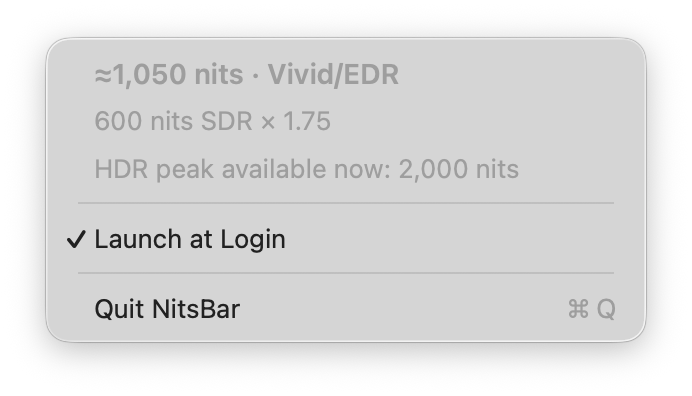

# NitsBar

A tiny native macOS menu-bar app that shows the luminance macOS is currently driving on an Apple display.



The value stays visible in the menu bar and updates automatically as brightness or EDR scaling changes. Click it to see the underlying SDR level, active EDR multiplier, available HDR peak, Launch at Login setting, and Quit command.

## Download

Download the latest `NitsBar` zip from the [latest release](../../releases/latest), unzip it, and move `NitsBar.app` to Applications.

The current build is locally signed rather than Apple-notarized. On first launch, macOS may require you to Control-click the app, choose **Open**, and confirm. Managed Macs may block unnotarized apps entirely.

## What the number means

- `600 nits` is the calibrated SDR luminance reported by macOS.
- `≈1,050 nits` means a software EDR tool is scaling desktop white above SDR; the app combines the current SDR reference white with the live display transfer gain. BrightIntosh's alternate HDR-overlay backend is detected separately because it does not change that transfer table.
- The dropdown separately shows the physical peak reported by the display's capability data.

NitsBar is a live system estimate, not a physical colorimeter measurement. It uses macOS's own panel calculation and display pipeline state.

## Build

Requires macOS 13 or later and Xcode or the Xcode command-line tools:

```sh
zsh build.sh
open build/NitsBar.app
```

The app is a single Swift source file with no third-party dependencies.

## Compatibility and privacy

NitsBar dynamically reads Apple's private `BrightnessControl` and `DisplayServices` frameworks. On built-in Liquid Retina XDR displays where macOS 26 refuses the calibrated-nits getter, it derives current SDR reference white from the calibrated range and Apple's live linear-brightness value. The physical EDR peak comes from the display capability dictionary, so temporary EDR headroom cannot be mislabeled as a multi-thousand-nit panel. It has been tested on Studio Display XDR and a built-in Liquid Retina XDR display with macOS 26.6. Because these are not public APIs, a future macOS update could require an adjustment.

No administrator access, log access, network connection, telemetry, or helper process is used. NitsBar is not affiliated with Apple.
